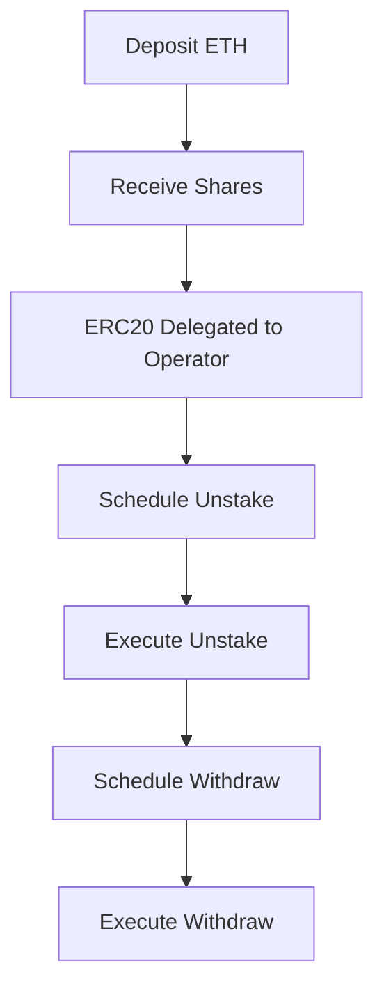

# Tangle Liquid Restaking Vault

A smart contract vault that enables liquid restaking on Tangle Network using Solmate's battle-tested ERC4626 implementation.

## Overview

This vault allows users to deposit tokens which get delegated to Tangle operators running blueprint services, while receiving a liquid token in return. The vault handles the complexities of managing deposits, unstaking, and withdrawals.

Vault curators select their underlying ERC20, operator, and blueprint selections for exposure on the Tangle Network. Users can deposit their tokens into the vault, which then delegates them to the selected operator. In return, users receive shares representing their deposited tokens. The vault receives the rewards from the operator and distributes them to the users based on their share holdings.

## Key Features

- **Liquid Restaking**: Users receive shares representing their deposited ERC20s
- **Operator Delegation**: Automatically delegates assets to a selected Tangle operator
- **Multi-step Withdrawals**: Handles the withdrawal process across both protocols:
  1. Schedule unstake from operator
  2. Schedule withdrawal from vault
  3. Execute final withdrawal
- **Cancellation Support**: Users can cancel unstaking or withdrawals at any point
- **State Management**: Tracks user requests and states independently
- **Token Support**: Handles both native assets and ERC20 tokens

## Technical Details

The vault is built on two main components:

1. **Solmate ERC4626**: Provides a secure, gas-efficient implementation for tokenized vault shares
2. **Tangle Network**: Offers the restaking infrastructure through its MultiAssetDelegation precompile

### Architecture

- Built on Solmate's battle-tested ERC4626 implementation for share-based accounting
- Supports both native assets and ERC20 tokens
- Integrates with Tangle's `MultiAssetDelegation` precompile for operator delegation
- Implements state machines for tracking unstaking and withdrawal requests
- Ensures proper access control and user isolation

### Usage Flow



### Rewards Architecture

The vault uses an accumulator-based system for tracking and distributing rewards fairly. Think of it like filling a pool of water (rewards) that gradually rises - each share is like a measuring stick that tracks how much the water level has risen since it was placed in the pool.

1. **Global Reward Accumulator**

   - Each reward token has a global accumulator that tracks rewards-per-share over time
   - When new rewards arrive: `accumulator += (newRewards * REWARD_FACTOR) / totalShares`
   - The accumulator represents the total historical rewards each share has earned
   - Using a large factor (1e18) maintains precision in the calculations

2. **User Snapshots**

   - Each user's position is tracked by snapshots that record:
     - Their share balance
     - The accumulator value when they last claimed
     - Any pending rewards

3. **Reward Calculation**

   ```
   pendingRewards = (userShares * (currentAccumulator - lastSeenAccumulator)) / REWARD_FACTOR
   ```

4. **Why This Works**

   - Like measuring water level rise:
     - Each share measures from when it was "placed in the pool"
     - New shares start measuring from current level
     - Old shares capture full historical rise
   - Automatically handles:
     - Users entering at different times
     - Different share amounts
     - Dynamic reward rates

5. **Example**
   - Alice places her 100-unit measuring stick at water level 0
   - Water rises by 0.1 units per stick (10 reward units / 100 total sticks)
   - Bob places his 100-unit stick at the 0.1 level
   - Water rises by 0.05 units (10 new reward units / 200 total sticks)
   - Final readings:
     - Alice's stick: Measured full 0.15 rise (15 rewards)
     - Bob's stick: Measured only 0.05 rise (5 rewards)

This system ensures rewards are distributed proportionally to how long and how many shares each user holds, while being computationally efficient by only updating state when users interact with the vault.

### Why this design?

Distributing rewards and accounting for them in LRTs is different than LSTs. The vault receives potentially many reward tokens that differ from the underlying asset being delegated and deposited in the restaking system. The rewards could have varying values and there might be no direct conversion between them and the underlying. This design ensures that rewards are distributed fairly and accurately to users based on their share holdings.

This means that the LRT does not increase in value but rather acts as a ticket to claim rewards. The rewards are distributed based on the user's share holdings and the total rewards accumulated in the vault. We track the claimability of rewards across actions such as transfers through this snapshot system.
