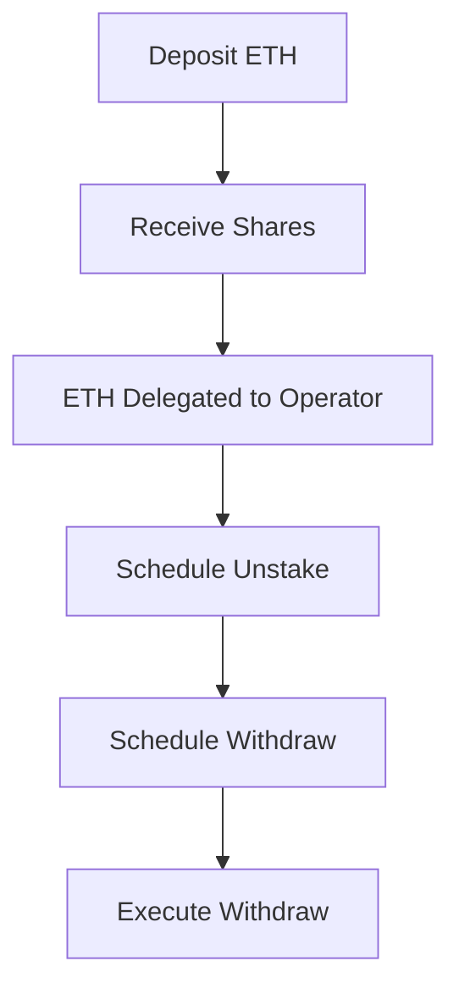

# Tangle Liquid Restaking Vault

A smart contract vault that enables liquid restaking on Tangle Network using Solmate's battle-tested ERC4626 implementation.

## Overview

This vault allows users to deposit tokens which get delegated to Tangle operators running blueprint services, while receiving a liquid staking token in return. The vault handles the complexities of managing deposits, unstaking, and withdrawals.

Two vault implementations are provided:

- **TangleLiquidRestakingVault**: For native asset (ETH) deposits
- **TangleLiquidRestakingTokenVault**: For ERC20 token deposits

## Key Features

- **Liquid Staking**: Users receive shares representing their deposited ETH
- **Operator Delegation**: Automatically delegates assets to configured Tangle operators
- **Multi-step Withdrawals**: Handles the withdrawal process across both protocols:
  1. Schedule unstake from operator
  2. Schedule withdrawal from vault
  3. Execute final withdrawal
- **Cancellation Support**: Users can cancel unstaking or withdrawals at any point
- **State Management**: Tracks user requests and states independently
- **Token Support**: Handles both native assets and ERC20 tokens

## Technical Details

The vault is built on two main components:

1. **Solmate ERC4626**: Provides a secure, gas-efficient implementation for tokenized vault shares
2. **Tangle Network**: Offers the restaking infrastructure through its MultiAssetDelegation precompile

### Architecture

- Built on Solmate's battle-tested ERC4626 implementation for share-based accounting
- Supports both native assets and ERC20 tokens
- Integrates with Tangle's `MultiAssetDelegation` precompile for operator delegation
- Implements state machines for tracking unstaking and withdrawal requests
- Ensures proper access control and user isolation

### Usage Flow

